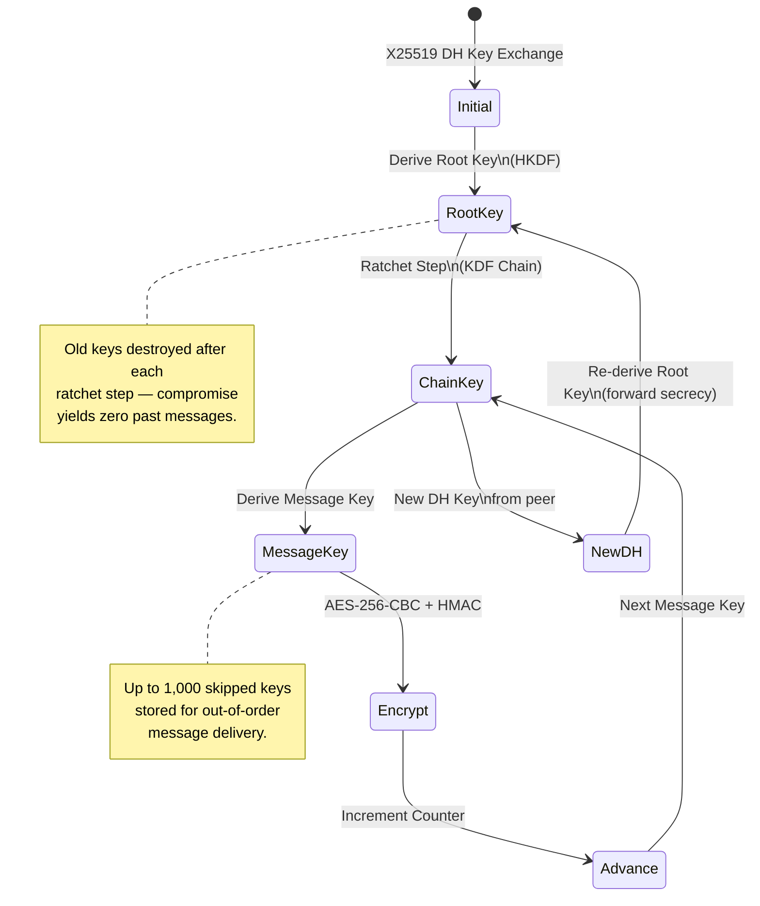
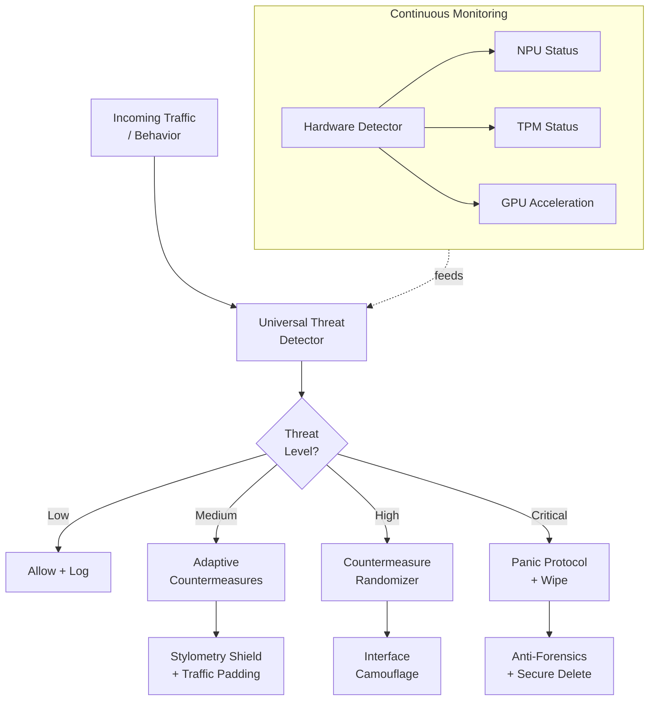

<div align="center">

# 🔐 CRYPTOGRAM

### The most over-engineered secure messaging platform ever built.

**Military-grade encryption. Post-quantum ready. Zero compromises.**

[](https://github.com/SWORDIntel/cryptogram/releases/tag/v1.1.0)
[](#downloads)
[](LICENSE)

### ⬇️ [Download v1.1.0](https://github.com/SWORDIntel/cryptogram/releases/tag/v1.1.0)

| Linux (.deb) | Linux (AppImage) | Android (APK) |
|:---:|:---:|:---:|
| [📦 49 MB](https://github.com/SWORDIntel/cryptogram/releases/download/v1.1.0/cryptogram-desktop_1.1.0-1_amd64.deb) | [📦 87 MB](https://github.com/SWORDIntel/cryptogram/releases/download/v1.1.0/cryptogram-desktop_1.1.0-x86_64.AppImage) | [📱 80 MB](https://github.com/SWORDIntel/cryptogram/releases/download/v1.1.0/cryptogram-android_1.1.0-universal-release.apk) |

</div>

---

> **CRYPTOGRAM** is not another Telegram fork with a dark theme and a padlock icon.
> It is a ground-up security hardening of a full messaging platform — **21,000+ lines**
> of purpose-built cryptographic, counterintelligence, and OPSEC code layered on top
> of a production messenger. Every message you send is wrapped in Double Ratchet
> forward secrecy, optionally quantum-resistant, and routed through traffic obfuscation
> that makes DPI weep. Your adversary is not "a guy with Wireshark." Your adversary
> is a nation-state SIGINT program — and CRYPTOGRAM was built to survive that.

> **Fully backwards compatible with Telegram.** Your existing accounts, chats, contacts, groups, channels, bots, and media work exactly as before. CRYPTOGRAM connects to the same Telegram network — all security enhancements are layered on top, transparently. No new account needed. No migration. Just install and go.

---

## 🏗️ The Five-Layer Security Stack

| Layer | What It Does | Why It Exists |
|-------|-------------|---------------|
| **1. Quantum-Resistant Transport** | Post-quantum key encapsulation (NIST algorithms) alongside classical ECDH | Because quantum computers are coming and your "encrypted forever" messages should actually stay encrypted forever |
| **2. Double Ratchet E2EE** | Signal Protocol implementation — X25519 DH, Ed25519 signatures, AES-256-CBC, HKDF, HMAC-SHA256 | Forward secrecy + break-in recovery. Compromise one key, lose zero past messages. Compromise today, lose zero future messages. |
| **3. Counterintelligence Engine** | Real-time threat detection, adaptive countermeasures, behavioral randomization, anti-fingerprinting | Detects when you're being watched and changes behavior to stay invisible |
| **4. OPSEC Hardening** | Panic password, anti-forensics, dead man's switch, DPI evasion, traffic padding, interface camouflage | Operational security for people whose lives depend on it |
| **5. Steganographic Layer** | 8 audio steganography methods, covert channel encoding, voice morphing, media metadata spoofing | When encryption isn't enough — hide the fact that you're communicating at all |

---

## 🔬 Feature Deep Dive

### Double Ratchet Protocol — Signal-Grade E2EE
- X25519 (Curve25519) Diffie-Hellman key exchange
- Ed25519 digital signatures for identity verification
- AES-256-CBC message encryption with HKDF key derivation
- HMAC-SHA256 message authentication
- Forward secrecy — old keys destroyed after use
- Break-in recovery — future messages secured even after compromise
- Out-of-order message handling with 1,000 skipped key slots
- Replay protection via message counter tracking
- TPM 2.0 / Android KeyStore / Apple Secure Enclave integration
- 3,774 lines of implementation. Battle-tested.

### Post-Quantum Cryptography
- NIST-compliant quantum-resistant algorithms
- Hybrid key exchange (classical + post-quantum)
- Configurable security levels: 128-bit, 256-bit, 384-bit
- Quantum key distribution roadmap
- Because "harvest now, decrypt later" is a real attack

### Counterintelligence Modules
- **Universal Threat Detector** — Pattern-based suspicious activity monitoring with real-time analysis
- **Adaptive Countermeasures** — Dynamic security posture adjustment based on threat level
- **Countermeasure Randomizer** — Unpredictable response patterns, anti-fingerprinting, timing obfuscation
- **Hardware Detector** — TPM, secure enclave, NPU, GPU detection across 34,000+ lines of code
- **Universal Security Validator** — Cryptographic algorithm verification, configuration auditing, compliance checking

### GNA Acoustic Security — *No other messenger has this*
Eight steganography methods in a single engine:
1. LSB (Least Significant Bit) embedding
2. Spectral masking in frequency domain
3. Echo-based steganography
4. Phase modulation embedding
5. Spread spectrum steganography
6. Adaptive LSB based on audio content
7. Psychoacoustic masking for imperceptibility
8. Cepstral domain steganography

- 100 bits/second undetectable embedding rate
- SNR >40dB audio quality maintenance
- AES-256 encryption of hidden payloads
- Reed-Solomon error correction
- Zlib compression before embedding
- Hardware acceleration with software fallback

### Covert Channel Engine
- TCP sequence number encoding
- HTTP header steganography
- DNS query encoding
- ICMP payload hiding
- DPI (Deep Packet Inspection) evasion
- Firewall traversal
- Traffic shaping resistance
- Statistical undetectability
- Replay attack prevention

### Voice Morphing
- Real-time voice transformation during calls
- Multiple morphing methods and presets
- Anti-voiceprint fingerprinting
- Natural-sounding output

### OPSEC Features
- **Panic Password** — Wipe everything on a secondary passphrase
- **Anti-Forensics** — Secure deletion with overwrite, no recoverable traces
- **Dead Man's Switch** — Auto-wipe if no activity within configurable window
- **DPI Evasion** — 5 methods: HTTPS, HTTP, DNS, Generic, Auto
- **Traffic Obfuscation** — Pattern randomization, timing obfuscation, padding
- **Interface Camouflage** — Disguise the app as something innocuous
- **Stylometry Shield** — Defeat authorship attribution analysis on your messages

### Privacy Controls
- Hide online status from all observers
- Suppress typing indicators
- Block read receipts
- Location privacy mode
- Screenshot prevention
- Screen recording detection
- EXIF/GPS metadata stripping from all media
- Timestamp anonymization
- Read-once messages
- Automatic history clearing

### Geographic Spoofing
- 50+ realistic location profiles
- Consistent timezone, locale, and network fingerprint matching
- Anti-geolocation triangulation

---

## 📊 The Competition Doesn't Come Close

| Feature | CRYPTOGRAM | Signal | Telegram | WhatsApp |
|---------|:---------:|:------:|:--------:|:--------:|
| Double Ratchet E2EE | ✅ | ✅ | ❌ (opt-in only) | ✅ |
| Post-Quantum Crypto | ✅ | ❌ | ❌ | ❌ |
| Audio Steganography | ✅ 8 methods | ❌ | ❌ | ❌ |
| Covert Channels | ✅ 4 protocols | ❌ | ❌ | ❌ |
| Voice Morphing | ✅ | ❌ | ❌ | ❌ |
| DPI Evasion | ✅ 5 methods | ❌ | ❌ | ❌ |
| Panic Password | ✅ | ❌ | ❌ | ❌ |
| Anti-Forensics | ✅ | ❌ | ❌ | ❌ |
| Dead Man's Switch | ✅ | ❌ | ❌ | ❌ |
| Hardware Key Storage | ✅ TPM/SE/KeyStore | ✅ SE | ❌ | ✅ SE |
| Threat Detection | ✅ Real-time | ❌ | ❌ | ❌ |
| Traffic Obfuscation | ✅ | ❌ | ❌ | ❌ |
| Stylometry Defense | ✅ | ❌ | ❌ | ❌ |
| Media Metadata Wipe | ✅ | ❌ | ❌ | Partial |
| Android + Desktop Parity | ✅ | ✅ | ✅ | ❌ |

---

## 📦 Downloads

**Latest release: [v1.1.0](https://github.com/SWORDIntel/cryptogram/releases/tag/v1.1.0)**

| Platform | Artifact | Size |
|----------|----------|------|
| Linux (Debian) | `cryptogram-desktop_1.1.0-1_amd64.deb` | 49 MB |
| Linux (AppImage) | `cryptogram-desktop_1.1.0-x86_64.AppImage` | 87 MB |
| Android (Universal APK) | `cryptogram-android_1.1.0-universal-release.apk` | 80 MB |

### Installation

**Debian:**
```bash
sudo dpkg -i cryptogram-desktop_1.1.0-1_amd64.deb
sudo apt-get install -f
```

**AppImage:**
```bash
chmod +x cryptogram-desktop_1.1.0-x86_64.AppImage
./cryptogram-desktop_1.1.0-x86_64.AppImage
```

**Android:**
Install the APK on Android 5.0+ (API 21+). All native libraries for arm64-v8a, armeabi-v7a, x86, and x86_64 are included.

---

## 🔧 Building from Source

See **[docs/BUILD.md](docs/BUILD.md)** for complete build instructions.

### Quick start — Desktop
```bash
./build_linux.sh
```

### Quick start — Android
```bash
./build_android.sh
```

### Quick start — Everything
```bash
./build_all.sh
```

---

## 🧬 Architecture

### Security Stack Overview

```mermaid
block-beta
  columns 1
  block:stack["CRYPTOGRAM Security Stack"]
    block:l5["Layer 5 — Steganographic"]
      l5a["Audio Steganography\n(8 methods)"]
      l5b["Covert Channel Engine\n(TCP / HTTP / DNS / ICMP)"]
      l5c["Voice Morphing"]
    end
    block:l4["Layer 4 — OPSEC Hardening"]
      l4a["Panic Password"]
      l4b["Anti-Forensics"]
      l4c["Dead Man's Switch"]
      l4d["DPI Evasion\n(5 methods)"]
      l4e["Stylometry Shield"]
    end
    block:l3["Layer 3 — Counterintelligence"]
      l3a["Universal Threat Detector"]
      l3b["Adaptive Countermeasures"]
      l3c["Countermeasure Randomizer"]
      l3d["Hardware Detector\n(TPM / NPU / GPU)"]
    end
    block:l2["Layer 2 — Double Ratchet E2EE"]
      l2a["X25519 DH"]
      l2b["Ed25519 Signatures"]
      l2c["AES-256-CBC"]
      l2d["HKDF / HMAC-SHA256"]
    end
    block:l1["Layer 1 — Quantum-Resistant Transport"]
      l1a["NIST PQ Algorithms"]
      l1b["Hybrid Key Exchange"]
      l1c["Security Levels\n128 / 256 / 384-bit"]
    end
  end
  l5 --> l4 --> l3 --> l2 --> l1
```



### Cryptographic Message Flow

```mermaid
flowchart LR
  subgraph Send["📤 Sender"]
    direction TB
    Plain1["Plaintext\nMessage"] --> Ratchet["Double Ratchet\nStep"]
    Ratchet --> KDF["HKDF-SHA256\nKey Derivation"]
    KDF --> AES["AES-256-CBC\nEncryption"]
    AES --> HMAC["HMAC-SHA256\nAuthentication"]
    HMAC --> PQ["Post-Quantum\nSeal (optional)"]
    PQ --> Stego["Steganographic\nEmbed (optional)"]
    Stego --> Obfus["Traffic\nObfuscation"]
  end

  subgraph Wire["🌐 Network"]
    direction TB
    Obfus -->|DPI-evading\ncovert channel| Transit["Encrypted\nTransit"]
  end

  subgraph Recv["📥 Receiver"]
    direction TB
    Transit --> Deobfus["Traffic\nDe-obfuscation"]
    Deobfus --> Destego["Steganographic\nExtract (if needed)"]
    Destego --> Verify["HMAC-SHA256\nVerification"]
    Verify --> Decrypt["AES-256-CBC\nDecryption"]
    Decrypt --> Deratchet["Double Ratchet\nStep (mirror)"]
    Deratchet --> Plain2["Plaintext\nMessage"]
  end

  Send --> Wire --> Recv

  subgraph HW["🔐 Hardware Key Storage"]
    TPM["TPM 2.0\n(Desktop)"]
    KS["Android\nKeyStore"]
    SE["Apple Secure\nEnclave"]
  end

  HW -.->|"key isolation"| Ratchet
  HW -.->|"key isolation"| Deratchet
```



### Double Ratchet State Machine



### Threat Detection Pipeline



---

## 📈 By the Numbers

| Metric | Value |
|--------|-------|
| Security code lines | 21,233+ |
| Steganography methods | 8 |
| Covert channel protocols | 4 |
| DPI evasion methods | 5 |
| Geographic profiles | 50+ |
| Supported ABIs | 4 (arm64, arm32, x86, x86_64) |
| Skipped message key slots | 1,000 |
| Audio stego embedding rate | 100 bits/sec |
| Audio stego SNR | >40dB |
| Security layers | 5 |

---

## 🎯 Who Is This For?

- **Journalists** operating in hostile environments where metadata alone can be lethal
- **Activists** organizing against authoritarian regimes
- **Whistleblowers** who need their communications to leave no trace
- **Security researchers** who understand threat models and demand more than "it's encrypted"
- **Privacy advocates** who refuse to accept "trust us" as a security model
- **Anyone** who reads the news and decides that "good enough" encryption isn't good enough

---

## ⚖️ License

**Dual Licensed** — AGPL-3.0 with OpenSSL exception for open-source use. A commercial license is available for organizations that cannot comply with AGPL source disclosure requirements. Contact the maintainer for licensing inquiries.

- **Free users**: Use, modify, and run it freely. No payment, no restrictions on personal use.
- **Commercial use**: If you distribute this software or let users interact with it over a network, you must publish **all your source code** under AGPL-3.0 — or obtain a commercial license.

See [LICENSE](LICENSE) for full terms.

---

<div align="center">

**[⬇ Download v1.1.0](https://github.com/SWORDIntel/cryptogram/releases/tag/v1.1.0)** · **[📖 Build Guide](docs/BUILD.md)**

Built for people whose threat model includes nation-states.

</div>
